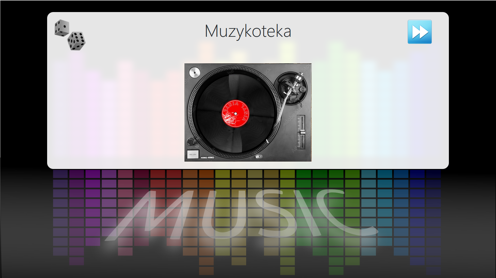
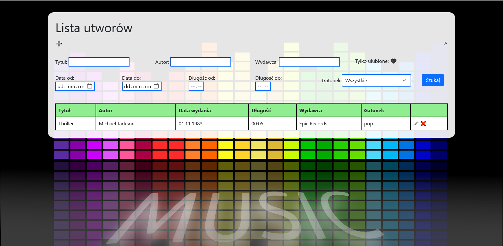
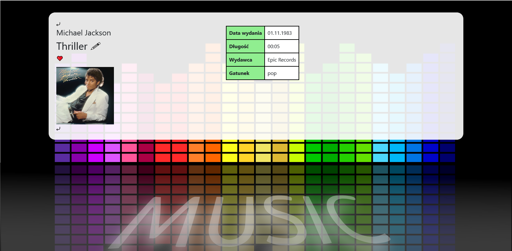
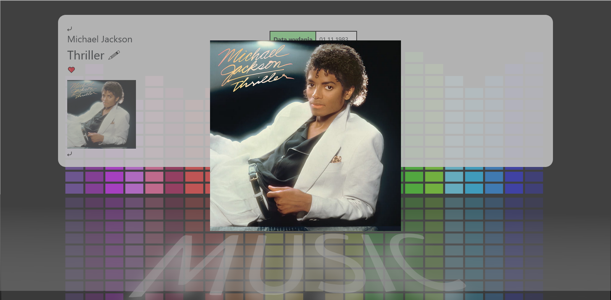

[English](../readme.md)
# Muzykoteka

**Technologie** 
C#, ASP.NET, Razor, Azure, Docker

Aplikacja webowa do dodawania, usuwania i przeglądania utworów muzycznych.

Poniższe instrukcje są do uruchomienia ograniczonej wersji (offline), ponieważ wydałem moje studenckie 100 $ na Azure :(  
**Uruchamianie**
1. Pobieramy i instalujemy .NET 6 i SQL Server
2. Pobieramy i uruchamiamy .exe z [dysku Google](https://drive.google.com/file/d/1Inz0HpUwetmiwv64TxsfUoc6WNOfhVbU/view)
3. Aplikacja jest uruchomiana na http://localhost:5000 oraz https://localhost:5001

Strona powitalna 

Strona powitalna – animacja 

Lista utworów 

Szczegóły utworu 

Szczegóły utworu — powiększona okładka 

Dodawanie utworu 
