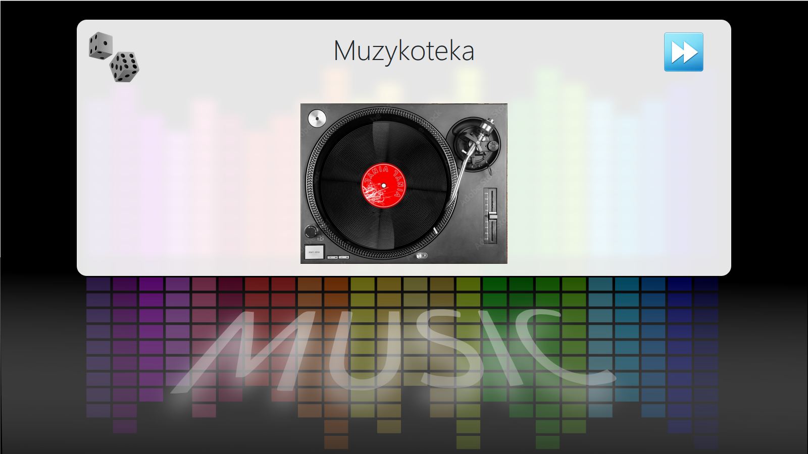
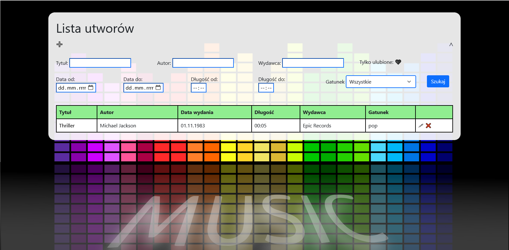
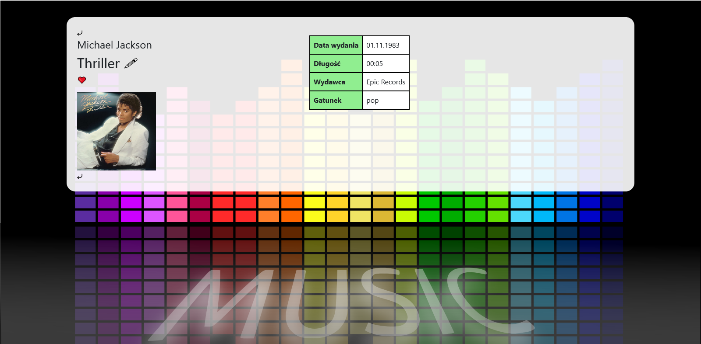

[Polski](Readme/readme_PL.md)
# MusicBase

**Technologies** 
C#, ASP.NET, Razor, Azure, Docker

Web application with adding, removing and browsing tracks.

Below is instructions to run limited, offline version, because I spent my student's $100 from Azure :(  
**Launching**
1. Download and install .NET 6 and SQL Server
2. Download and run .exe from [Google Drive](https://drive.google.com/file/d/1Inz0HpUwetmiwv64TxsfUoc6WNOfhVbU/view)
3. Application is started on http://localhost:5000 and https://localhost:5001

Welcome page 

Welcome page – animation 

Musics list 

Music details 

Music details – cover enlarger 

Music adding 
